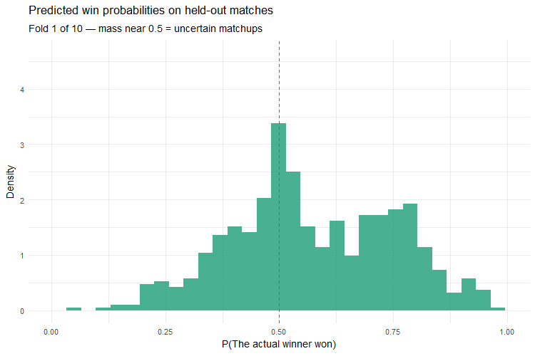
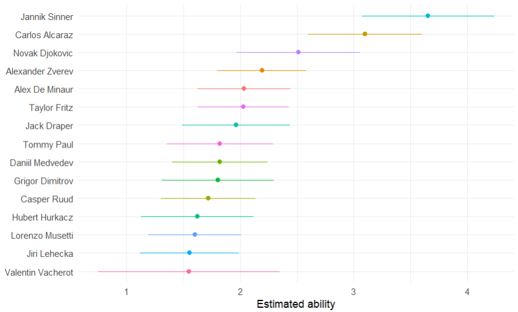
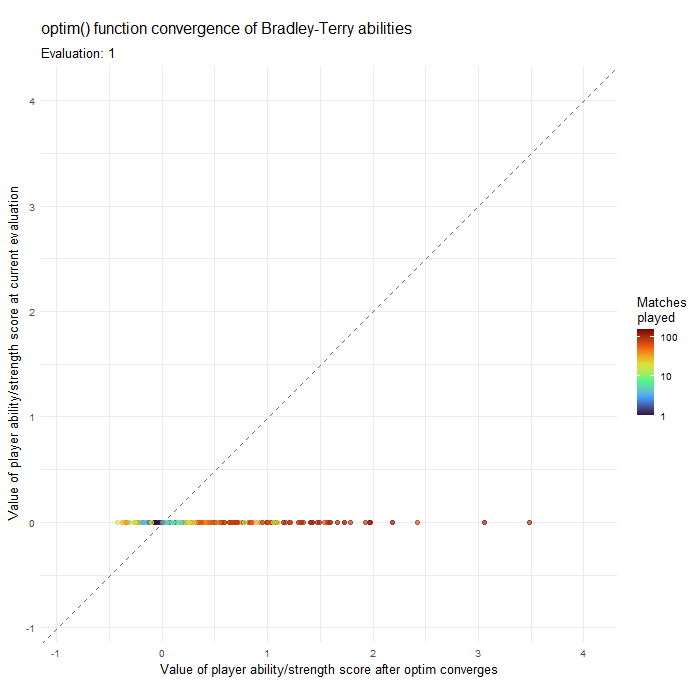
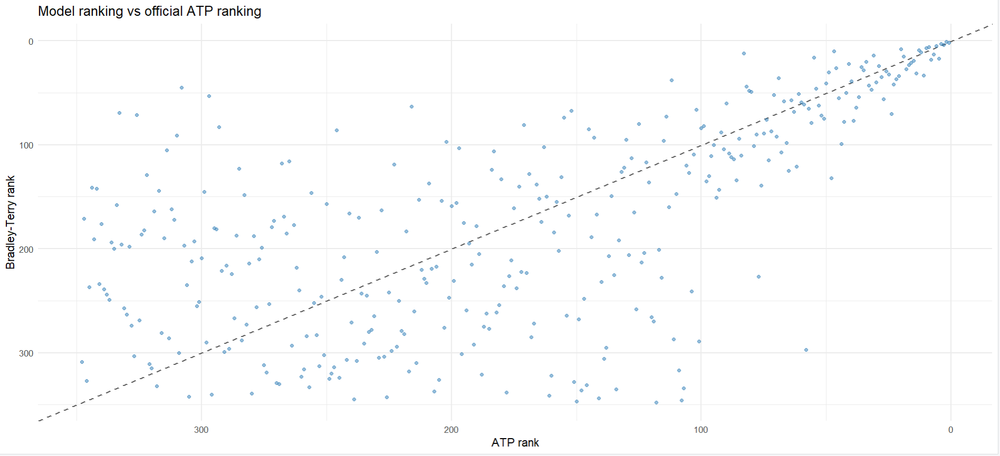

## Predicted probabilities of actual winners

:::: {layout="[60,40]" layout-valign="center" .column-page}

{width=100%}

::: {}

When we pick a training set and a test set we check what probability we assigned to the actual winner of each game in the test set. Here we see how well our model assigned probabilities to the winner in each hold-out set. This is the essence of what log loss captures as a performance metric, how confident were we in our prediction?

We can see the plot is most active around the centre whilst being noticeably more dense to right of the centre. This is what we would expect and hope for, it illustrates that our model outperforms a naive baseline that assigns every player a 50% chance of winning.

  

- $p_{ij}$ — probability that player $i$ beats player $j$
- $\beta_i$ — ability/strength score of player $i$, estimated by the model
$$
p_{ij} = \frac{e^{\beta_i}}{e^{\beta_i} + e^{\beta_j}}
$$

$$
P(\text{actual winner won}) =
\begin{cases}
p_{ij} & \text{if player } i \text{ won} \\
1 - p_{ij} & \text{if player } j \text{ won}
\end{cases}
$$

:::

::::

## Centipede plot: Player Rankings with Uncertainty Estimates 

::: {layout="[60,40]" layout-valign="center" .column-page}

Each row shows one of the top 15 players by estimated ability, with the dot marking the MAP estimate of $\beta_i$ and the coloured line an approximate 95% interval calculated from the standard errors. The key feature is the overlap between neighbouring intervals, where two players' intervals overlap substantially, the model cannot confidently say one is stronger than the other. Aside from Novak Djokovic, the model is confident Jannik Sinner and Carlos Alcaraz are head and shoulders above their competition. Valentin Vacherot's large interval is also of interest since we would like to determine what is causing such uncertanty in his estimated ability.

:::

  

## Model shrinkage visualised via optim() convergence

::: {layout="[40,60]" layout-valign="center" .column-page}

This animation visualises the optimisation process that produces the model's final ability estimates. Each point represents one of the 584 ATP players, positioned by their ability score at the current stage of the optimisation (vertical axis) against their final converged estimate (horizontal axis). As optim()'s BFGS method iterates on the negative log-posterior, we can see the points move around until settling on the 45° diagonal, at which point the current and final estimates coincide and the optimiser has converged. The players' points are coloured by the number of matches each have played, this is a nice visualisation of the regularisation at work, we can see many points clustering around zero. Players with large match counts travel furthest from the origin, as the data dominates the prior, while sparsely observed players remain shrunk towards zero throughout. Most of the movement occurs within the first few iterations, with the remainder of the animation showing progressively finer refinements.

:::

## How do ATP rankings compare to our Bradley-Terry model rankings?

This plot compares the rankings implied by the Bradley–Terry abilities against the official ATP rankings for all players appearing in both lists. The ATP ranks players by summing the points of each player from their best nineteen tournament results over the most recent 52 week period. A higher amount of points are rewarded for winning matches in Grand Slam competitions and the ATP finals than some of the less prestigious ATP competitions. 

In the plot, each point is a player, positioned by their ATP rank and their model rank, with the dashed diagonal indicating equal ranking. Agreement between the two rankings is strongest among the top players and deteriorates steadily down the list. Points cluster closer to the diagonal in the top 50 but spread increasingly wide in the tail as we get to lower ranked players. Disagreement grows further down the rankings, where players contest fewer tour-level matches and both systems have less information to distinguish them. 

