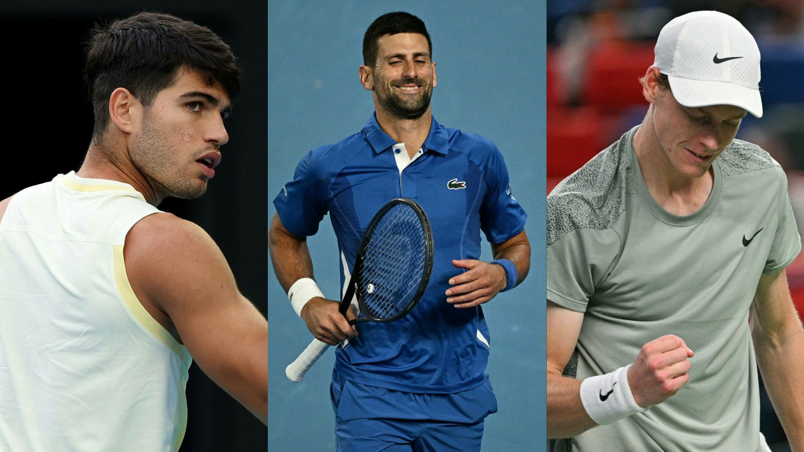
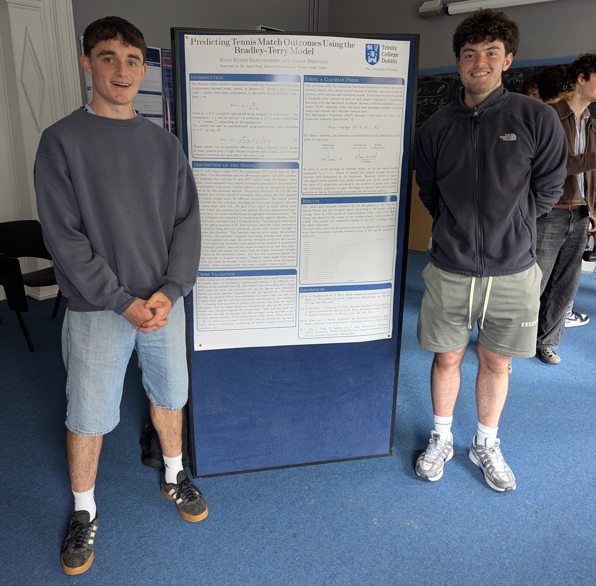

---
title: "Predicting Tennis Match Outcomes Using The Bradley-Terry Model"
---

::: {.hero}

## A Bradley-Terry model with regularised MAP estimation
:::

::: {.lead}
Can we predict the winner of a professional tennis match better than the official rankings? This project builds a Bradley-Terry model on ATP match data from the 2024 & 2025 seasons, fitting player strengths by Maximum A Posteriori estimation and tuning the prior's regularisation parameters via a cross-validated 2D grid search.

:::

## What is a Bradley-Terry Model?

The Bradley-Terry model is a way of turning a set of head-to-head results into a single strength score for each competitor. Every player has some underlying ability, and when two players meet, the probability of each winning depends on the gap between their abilities. A big gap means the stronger player almost always wins, a tiny gap means the match is close to a coin flip.

The model works backwards from head-to-head results to abilities/strength scores. Beating a strong opponent nudges your score up more than beating a weak one, and losing to a weak opponent drags it down more than losing to a strong one. The scores are all connected, your rating depends on your opponents' ratings, which depend on their opponents' ratings, and so on across the whole network of matches so the model can compare two players sensibly even if they've never played each other.

Once fitted, the scores both rank the players and give a concrete win probability for any hypothetical matchup. The rigorous definition of a Bradley-Terry model is outlined in the [full report](bt_report_1).

## Why use a Bradley-Terry Model for tennis?

Tennis results can be predicted effectively using a Bradley Terry model as many players play
a high volume of games each season, and the only potential outcomes for each player are win
or loss. In addition, the model naturally reflects the significance of each result, an upset will harshly punish the high-rated and strongly reward the low-rated player. Likewise, an unsurprising result where a high-rated player beats a low-rated player will offer minor adjustments in players' ratings. This made the model a natural tool for both assessing player strength and forecasting future matches.

## Brief Results Summary of the Model
Model parameters were estimated by MAP on ATP match data from the 2024 and 2025 seasons. Model performance was assessed through k-fold cross-validation with k = 10, which
produced accuracy of 63.55% and a log loss of 0.627, reasonable results for
a model based solely on match outcomes. Log loss is how we measured model performance, the rational for log loss as a metric of performance is outlined in the report.

Predictive performance was then assessed on matches from the first half of the 2026 season (02/01/26 to 21/06/26), which were held out entirely from fitting and tuning. The predictive accuracy of our model here was 62.76%. Comparing this value to using the ATP rankings as a method of prediction we get a predictive accuracy of 63.52%. The predictive accuracy doesn’t capture the full strength of this model alone since this value is still reasonable considering the model does not include any extra covariates, such as surface or recent form. We can be happy with these results.

Many thanks to Dr Jason Wyse for his guidance throughout the project, and to Prof Nikhil Savale for organising the research internship.

